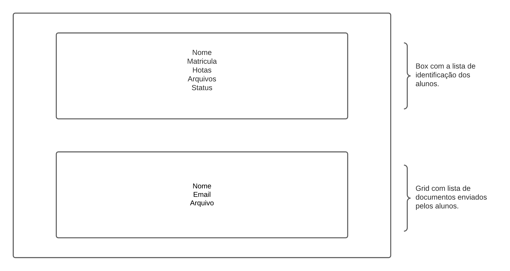

# desafio-getinfo

## 💻 Sobre o projeto

 - Desafio sobre a criação de gerenciamento de certificados para aluno feito em javascript.

---

 

  

## 🛠 Tecnologias

As seguintes ferramentas foram usadas na construção do projeto:

- JavaScript
- HTML
- CSS

## Detalhes sobre o projeto:

- O desafio é estruturado em 3 pastas.
- Css - Pasta contendo a estilização da página.
- Img - Pasta contendo a imagem usada no perfil da página.
- Js - Pasta contendo o codigo utilizado no projeto.

## Documentação 

- Documentação com diagrama do projeto.

  

## 📝 Licença

Este projeto esta sobe a licença [MIT](./LICENSE).
